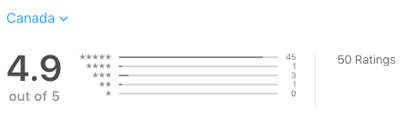

# Bubble Burst - iOS

I released this game on the iOS App Store and accumulated over 1.1k downloads and a 4.9 rating.

Bubble Burst is an arcade game designed for iPhones and iPods. The premise of the game is to tap bubbles (or other objects) before they leave the screen. The game also has power ups, an in-game store, as well as an accessibilty option for color-blind individuals.

The game includes 3 game modes: 
 - Classic - 10 lives
 - Timed - 1 Life
 - Endless - Unlimited Lives

### Features:

  - Customization of gameplay and appearance
  - GameCenter integration
  - Google Admob integration
  - Firebase integration
  - iCloud data syncing

### Software Used:

Bubble Burst was made entirely by me using the following software: 

* Xcode - Apple's Development Platform
* Adobe Illustrator - Vector Graphics
* Adobe Photoshop - Raster Graphics

### Promo:

To watch the promotional video for the app, watch it on [YouTube](https://www.youtube.com/watch?v=XSrwhmU5YyU) or 
download it from the [repository](./Promo.mp4).

### Screens:

  
  

